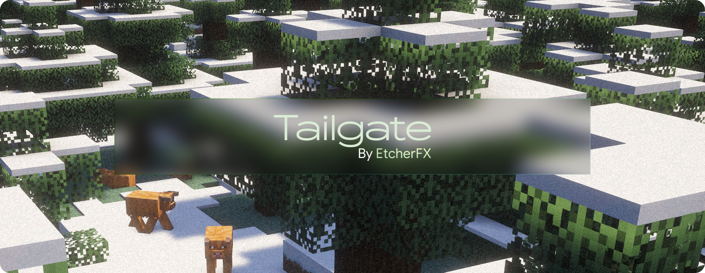

<h1 align="center">
  
</h1>

<div align="center">


[](https://github.com/etcherfx/tailgate/releases/latest)
[](https://github.com/etcherfx/tailgate/actions/workflows/build.yml)

**A Minecraft mod for joining a friend's Tailscale Funnel server without Tailscale or an account.**

[Player guide](#player-guide) · [Host guide](#host-guide) · [Security model](#security-model) · [Development](#development)

</div>

[Tailscale Funnel](https://tailscale.com/kb/1223/funnel) publishes the server as a TLS connection on a public `*.ts.net` name. Minecraft can't speak TLS, so Tailgate runs a small forwarder inside your game: the server list gets an entry for `127.0.0.1:<port>`, and Tailgate carries that connection to your friend's Funnel over verified TLS.

One jar works on:

| Loader | Minecraft |
|---|---|
| Fabric and Quilt | 1.14 – 26.3 |
| Forge | 1.7.10 – 26.3 |
| NeoForge | 1.20.2 – 26.3 |

Tailgate is client-only. It does nothing on a dedicated server, and the server doesn't need it.

## Player guide

1. Download `tailgate-<version>.jar` from the [latest release](https://github.com/etcherfx/tailgate/releases/latest) and put it in your `mods` folder. Fabric doesn't need Fabric API.
2. Start Minecraft and open **Multiplayer**.
3. Click **Tailgate** in the top-right corner.
4. Fill in the form:
   - **Name:** anything you like.
   - **Address:** the address your friend sent you, like `their-pc.tail1234.ts.net`. Add `:443` or `:8443` if they gave you a port. Without one, Tailgate uses 10000.
5. Click **Test** to check that the server answers, then **Add**.

The server appears in your list as `127.0.0.1:<port>`. Join it like any other server.

Things to know:

- Keep Tailgate installed. The server-list entry only works while Tailgate is running.
- To remove a server, delete its entry in the Multiplayer screen. Tailgate stops its forwarder the next time that screen opens.
- If the host is offline, the entry shows a message in the server list instead of timing out.
- Saved servers live in `config/tailgate/servers.json` in your game folder.

## Host guide

Funnel makes your server reachable from the whole internet, so read the [Security model](#security-model) before you share it.

You need Tailscale on the computer that runs the Minecraft server, and a tailnet where Funnel is allowed. The first `tailscale funnel` command walks you through enabling Funnel and HTTPS certificates. Funnel also needs MagicDNS, which new tailnets have on by default. See Tailscale's [Funnel requirements](https://tailscale.com/kb/1223/funnel#requirements-and-limitations).

1. Start the Minecraft server as usual. This guide assumes port 25565.
2. Share it:

   ```sh
   tailscale funnel --bg --tls-terminated-tcp=10000 tcp://127.0.0.1:25565
   ```

   Funnel ends TLS on your machine and passes plain Minecraft traffic to the server. `--bg` keeps the Funnel running, including after a reboot.
3. Run `tailscale funnel status` to see your address, then send your friends the host name, like `your-pc.tail1234.ts.net`. Funnel can also use port 443 or 8443. If you pick one of those, send it along too, like `your-pc.tail1234.ts.net:443`.
4. To stop sharing:

   ```sh
   tailscale funnel --tls-terminated-tcp=10000 off
   ```

Public DNS for a new Funnel name can take up to 10 minutes to appear. Funnel traffic is also subject to Tailscale's bandwidth limits.

## Development

Builds run on JDK 25; everything compiles to Java 8 bytecode. Gradle finds an installed JDK 25 (`JAVA_HOME`, SDKMAN, `~/.jdks`, or your OS's usual locations) or downloads one automatically. Starting `./gradlew` itself takes JDK 17 or newer on `JAVA_HOME` or `PATH`.

```sh
./gradlew build                        # core tests, plus the UI for the active node (26.3-fabric)
./gradlew build -Ptailgate.nodes=all   # every Minecraft release and loader: one merged jar
./gradlew build -Ptailgate.nodes=1.20.1-forge,1.21.1-neoforge   # just these (plus the active node)
```

The jar lands in `build/libs/`. `verifyJar` checks it: Java 8 class files only, relocated Kotlin, one class per `@Mod` type, and a UI build for every entry in `targets.toml`.

How it fits together:

- **`core/`** holds the forwarder, TLS, server store and form logic. It's plain Kotlin with no Minecraft code.
- **`entry/`** holds the loader entry points. They work out which game is running and load the matching UI build.
- **`ui/`** is compiled once per Minecraft release and loader (a Stonecutter "node", listed in `targets.toml`) with Unimined. `ui/src/main/*/mojmap` covers 1.14 and newer; `ui/src/main/*/mcp` covers Forge 1.7.10–1.13.2.
- **The merge step** relocates each node into its own package and combines everything into one jar with a shaded, relocated Kotlin standard library.

See [CONTRIBUTING.md](CONTRIBUTING.md) before opening a pull request.

### Runtime test

The `runtimeTest` task launches a real game with the merged jar and runs Tailgate's in-game self-test. The self-test opens Multiplayer, uses the Tailgate button, tests against a local TLS server, and adds an entry. First build a jar that includes the release, then:

```sh
./gradlew runtimeTest --node 1.20.1-forge
```

It needs only a JDK. The game runs on JDK 8, 17, 21 or 25, whichever is the oldest its release supports (1.17.x runs on Java 17). Gradle finds those JDKs in the usual install locations or downloads them. Point it at other locations with `-Porg.gradle.java.installations.paths=<jdk>,<jdk>`. Downloads and game directories go to `build/runtime-test`; pass `-Ptailgate.runtimeDir=<dir>` to use another directory.

It installs Minecraft and the loader build listed in `targets.toml` with [HeadlessMC](https://github.com/headlesshq/headlessmc) (`--loader-version` picks another), fails the task unless the self-test passes, and never waits for input. A window opens while the game runs; on Linux, wrap the command in `xvfb-run`. CI runs it for a smoke set of releases on every push, and for every release on tags.

## Security model

What the host exposes:

- **Anyone who knows the name can connect.** Funnel makes the server reachable from the whole internet, not just by Tailgate users. Keep `online-mode=true` so every player needs a real Minecraft account, and consider a whitelist.
- **Every player's IP address looks like `127.0.0.1`.** Connections come from Tailscale on the host machine, so IP bans and per-IP limits don't work. If your server software supports the PROXY protocol, Funnel's `--proxy-protocol=2` flag can pass the real addresses through.

What Tailgate does on the player's machine:

- **Only loopback.** Each forwarder listens on `127.0.0.1`, so other devices on your network can't use it.
- **Only the host you added.** A forwarder connects to the one address saved for it, and only when Minecraft connects to its entry (joining or refreshing the server list).
- **Verified TLS, with no way to turn verification off.** Tailgate checks the host's certificate against Java's trusted authorities plus Let's Encrypt's roots, which ship inside the jar because older Java 8 builds lack them. It checks that the certificate matches the host name, and it only allows TLS 1.2 and 1.3.
- **The server sees the real address.** Tailgate rewrites the handshake from `127.0.0.1:<port>` to the Funnel address, so servers and proxies that route by host name work.
- **No accounts, no telemetry, no other network traffic.**

Funnel's relays don't decrypt the traffic: TLS runs from Tailgate to Tailscale on the host's machine.

To report a vulnerability, see [SECURITY.md](SECURITY.md).

## License

Tailgate is licensed under the [GNU Lesser General Public License v3.0](LICENSE). The LGPL builds on the GNU GPL v3.0, whose text is included in the same file. The jar also contains parts of the [Kotlin](https://kotlinlang.org/) standard library, under the Apache License 2.0; its license and notices are in [`licenses/kotlin`](licenses/kotlin) and ship inside the jar.
